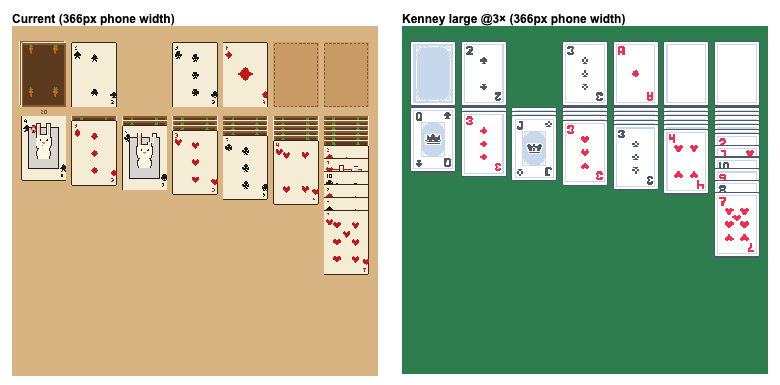
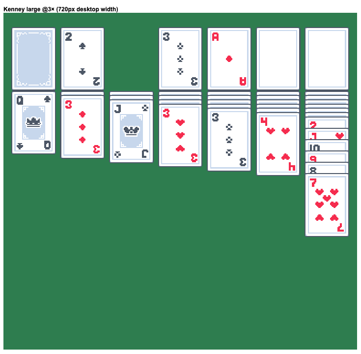

# Solitaire: replace the hand-rolled card art with a CC0 sprite deck

Status: **implemented** — reviewed against `solitaire/` at `dce5352` and built
on 2026‑09‑05. §1–§5 shipped; §6 is still open. Four things changed from the
plan during implementation, all verified against a headless render of the real
renderer:

1. **`TABLEAU_Y` had to move, 220 → 250.** §4.2 kept it, but at `SCALE = 3`
   the top row ends at `TOP_ROW_Y + CH = 220` — zero gap — and the stock's
   pile-depth badge (`TOP_ROW_Y + CH + 6`, 5·SCALE tall) would have printed
   underneath the tableau.
2. **Every vertical offset is a multiple of `SCALE`.** `FACE_DOWN_OFFSET` 14 →
   15, `FACE_UP_OFFSET` 40 → 42. The peek strips slice the sprite, and 14/40
   land mid-authored-pixel, so each card in a column would shear differently.
   42 also clears the rank glyph (authored rows 5–12) with a row to spare
   rather than one pixel. With (1) this makes `INTERNAL_H` 1036, not 970.
3. **Empty slots stay hand-drawn.** §4.3 left this to the designer. Kenney's
   `card_empty` is a *white card* with a decorative frame — on green felt it
   reads as a blank card you could pick up. The recessed-felt + dashed-ghost
   outline reads as a hole, so it and the recycle arrow were kept and
   recoloured.
4. **Three literals that were tuned at `SCALE = 2` are now SCALE-relative:**
   the highlight frame thickness, the stacked-stock diagonal offset, and the
   drag shadow strips (§5's checklist flagged the last of these). They would
   all have gone hairline against the bigger art.

`_drawPileCount` kept a 10-digit pixel font rather than moving to Press Start
2P. Open questions §7 were resolved as: green felt with the CSS chrome retuned
(1), slate → near-black yes (2), and yes to shipping CC0 faces ahead of the
rabbit court cards (3).

---

Scope is `apps-sdk` only (`solitaire/js/renderer.js`, `solitaire/styles.css`,
`solitaire/index.html`, `build.config.mjs`, `solitaire/README.md`). No SDK,
host, or backend changes. Game rules, input, scoring and the daily-deal seed are
untouched.

## 1. Problem

The card art in `renderer.js` is painted procedurally from hand-placed
`fillRect` calls at a 56×80 authoring size, then scaled 2× into 112×160 sprites
on a 900×860 canvas. The canvas is CSS-scaled to the column — ≤720 px on
desktop, ~350 px on a phone. That last step is what breaks it.

Measured from a headless render of the current renderer (mid-game board, 366 px
phone width — see the left half of the image in §3):

| Issue | Where | Effect on a phone |
| --- | --- | --- |
| Ranks are a 3×5 px hand font (`RANK_GLYPHS`, `renderer.js:99`) | 6×10 internal px | **~2×4 device px — unreadable.** In the tableau the face-up peek strip is 32 internal px (~12 device px), so that digit is the *only* thing identifying a card. |
| Card back is flat brown with carrots in the corners only (`buildCardBack`) | 12 px face-down peek shows a brown band + green leaf dots | A column of 6 hidden cards reads as striped dirt, not a deck. |
| Court cards: one identical rabbit on all 12, inside a grey/pink inset panel with its own suit-coloured border (`drawCourtRabbit`) | Panel border collides with the corner pip | Reads as a card-inside-a-card; J/Q/K are indistinguishable at tableau scale. The comments at `renderer.js:473` show this was already patched once. |
| Cream cards on light-tan felt; drop-target highlight is pale yellow (`COL_HIGHLIGHT`) | Low contrast everywhere | Legal-drop frames are nearly invisible; empty slots are tan-on-tan. |
| Pip region is 23×42 authored px | 7–10 pips crowd | Minor, but 8/9/10 need the corner rank to tell apart. |
| `solitaire/README.md` describes a 480×720 Game Boy mint/green palette | — | Stale; the code is 900×860 light oak. The doc drifted through several redesign passes. |

What is **not** the problem: the renderer architecture. Prerendered per-card
offscreen canvases, one `SCALE` knob, integer-pixel layout, hit-testing and drag
all work and stay as they are. Every change below is inside the sprite-*painting*
functions or is a constant.

## 2. Decision: swap in a CC0 pixel deck rather than keep hand-tuning

Redrawing the art by hand has been tried several times already (the renderer's
comment history is a log of it) and cannot get past the underlying constraint:
a 3×5 glyph on a 56 px-wide card is not legible at 45 device px, and there is no
room to make it bigger without redesigning every face. A pre-made deck with a
proper 5×7-class rank font fixes rows 1, 3 and 5 of the table above in one
move, and the identity work (OddsRabbit back, rabbit court cards) can then be
done *at the deck's resolution* as a follow-up instead of blocking this.

### Chosen pack: Kenney "Playing Cards Pack"

- Download: <https://kenney.nl/assets/playing-cards-pack> (mirror:
  <https://opengameart.org/content/playing-cards-pack>, `playing-cards-pack_0.zip`, 192 KB).
- License: **CC0 1.0** (`License.txt` in the zip). Credit to "Kenney.nl" is
  requested, not required. No attribution clause to satisfy in the shipped bundle.
- Contents used: `PNG/Cards (large)/` — 52 faces `card_{clubs,diamonds,hearts,spades}_{A,02..10,J,Q,K}.png`,
  plus `card_back.png`, `card_empty.png`. (Medium/small sizes, jokers, UNO-style
  colour cards and dice are not used.)
- Geometry, measured: each PNG is a 64×64 tile; the card occupies the
  **42×60 box at (11, 2)**. That is the same 0.7 aspect as the current 56×80
  authoring size, so the layout math changes by constants only.
- Palette, measured: white `#ffffff` faces, red `#f52c4e`, "black" suits are
  slate `#4d5766`, border/back tint `#c7d7ec`.

Alternatives considered and why not:

| Pack | License | Why not |
| --- | --- | --- |
| jfredd "Pixel Cards", 50×75 — <https://jfredd.itch.io/pixel-cards> | CC0 | Perfectly usable fallback (52 faces, 10 backs). Kenney's crown-glyph court cards and included empty/back slots fit the 8-bit house style slightly better; pick this if Kenney's look is rejected in review. |
| Byron Knoll / notpeter "Vector-Playing-Cards" — <https://github.com/notpeter/Vector-Playing-Cards> | Public domain | Classic Bicycle-style SVG. Maximum legibility, but it breaks the pixel-art house style shared with Snake / 2048 / Press Start 2P. Only if we decide Solitaire should not be 8-bit. |
| Keep hand-drawing | — | See above. |

## 3. What it looks like

Same shuffle, same layout constants, rendered at a 366 px phone width. Left is
the current renderer; right is the Kenney large set at `SCALE = 3` on a green
felt (mock built with a throwaway harness — not the real renderer, but the same
column/offset math).



Desktop width (720 px), Kenney @3×:



Note in the mock: the pale blue Kenney back is a placeholder (§4.4), and the
face-up peek strip is tighter than it should be because the mock kept
`FACE_UP_OFFSET = 32` — §4.2 bumps it to 40.

## 4. Implementation

Estimated effort: about one dev-day including the README/credits and a device
pass. Steps are ordered so the game is playable after each one.

### 4.1 Assets → atlas

1. Add `solitaire/images/`. Commit Kenney's `License.txt` there as
   `solitaire/images/KENNEY-LICENSE.txt`.
2. Build **one atlas PNG** rather than 54 separate files (one request on the
   mobile WebView, one `Image` load in boot): crop the 42×60 box out of each
   large tile and lay them out as a 13-column × 4-row grid in the existing card
   integer order (`card = suit * 13 + rank`, suits clubs/diamonds/hearts/spades,
   ranks A..K — `deck.js:14`), then a 5th row for `back`, `empty`, and the
   OddsRabbit back from §4.4. Atlas is 546×300 px.
3. Commit the one-off script that produces it (`solitaire/tools/build-atlas.py`
   or `.mjs`, whichever is easier — PIL and Node are both fine) alongside the
   output `solitaire/images/cards.png`, so the atlas can be regenerated when
   §4.4/§6 sprites are added.
4. `build.config.mjs`: add `mkdir dist/solitaire/images` and a `copyFile` for
   `cards.png` + the license, mirroring how `snake/images/head.png` is handled
   (`build.config.mjs:131,273`).

Optional in the same script: remap Kenney's slate `#4d5766` to a near-black
(e.g. `#1a1a1a`, the current `COL_BLACK`) for contrast on the felt. Also decide
whether `#f52c4e` red stays or moves toward the current `#c01818`. Palette
remaps are a dictionary in the atlas script, not hand edits.

### 4.2 Renderer constants (`solitaire/js/renderer.js`)

```
CARD_W  56 → 42
CARD_H  80 → 60
SCALE    2 → 3            // CW 112 → 126, CH 160 → 180
FACE_DOWN_OFFSET 12 → 14  // scaled with CH
FACE_UP_OFFSET   32 → 40  // Kenney rank+pip occupy the top ~12 authored px = 36 internal; 40 clears it
INTERNAL_W  = 2*MARGIN + 7*CW + 6*COL_GAP  → 998   (formula unchanged)
INTERNAL_H  860 → 970     // longest legal column: TABLEAU_Y + 6*14 + 12*40 + 180 = 964
```

Export `Renderer.SCALE`. `application.js:1194` hardcodes `INTERNAL_W / 2` for
the device-pixel snap — change it to `INTERNAL_W / RendererClass.SCALE` or the
snap silently targets the wrong grid.

### 4.3 Sprite builders → atlas blits

Replace the bodies of `buildCardFace`, `buildCardBack`, `buildEmptyFoundation`
with a `drawImage(atlas, sx, sy, 42, 60, 0, 0, CW, CH)` into the same offscreen
canvas each currently returns (keep `imageSmoothingEnabled = false`). The
per-frame draw loop (`Renderer.prototype.draw` and everything it calls) does not
change — it still blits cached canvases.

Delete: `RANK_GLYPHS` (except keep `0`–`9` for `_drawPileCount`, or switch the
pile count to a tiny Press Start 2P text — either is fine), `SUIT_SPRITES`,
`paintMonoSprite*`, `drawRankAt`, `rankWidth`, `pipLayout`, `drawCourtRabbit`,
`drawCrown`, `drawFlower`, `drawCarrotSprite`. That is roughly 400 lines gone.

Keep `buildEmptyStock`'s recycle arrow (redraw it over the Kenney `empty`
sprite, or keep the current dashed outline — designer's call, both read fine).

**Boot ordering.** `application.js:61` constructs the renderer synchronously
and the sprite cache is built in the constructor. The atlas is an image and
loads async, so either:

- (preferred) give the renderer a static `Renderer.load(url) → Promise` that
  resolves once the `Image` has decoded, and have `application.js` construct
  the renderer inside `.then()`. The pre-deal `render()` path
  (`application.js:141`) already paints just the felt with no renderer state,
  so nothing is visible until the deal anyway; or
- inline the atlas as a `data:` URI in a generated `cards_atlas.js` and keep the
  constructor synchronous. Works, but bloats the JS and needs a build step.

Guard the failure case: if the atlas fails to load, show the existing
`.bootstrap-error` block rather than a blank felt.

### 4.4 OddsRabbit card back (the one piece of new art)

Kenney's back is a plain pale-blue panel; it is the placeholder in the mock. Draw
a **42×60** back that keeps Kenney's 1 px light border (so face-down peeks still
read as stacked card edges) and puts the carrot motif on a dark ground — the
current `COL_BACK_PRIMARY`/`COL_BACK_ACCENT` browns, or a green that matches the
new felt. Put it in the atlas' 5th row. Requirements that came out of the
current back's comment trail (`renderer.js:548`): the top 14 internal px (≈5
authored px) must carry something recognisable, since that is all a face-down
column ever shows.

### 4.5 Palette and CSS

- Felt: pick one and set it in **both** places — `COL_FELT` in `renderer.js`
  (exported and reused by the pre-deal paint) and `--wood` in `styles.css`.
  Recommendation: a mid green (`#2e7d4f` in the mock) — white Kenney faces
  need a darker ground than the current oak, and green is the universal
  solitaire cue. Keeping wood is acceptable if it drops to a darker tone; the
  current `#d9b483` does not work under white cards.
- `COL_HIGHLIGHT`: on green, a bright cream/yellow frame works; verify it reads
  in the drag state on a real phone.
- `COL_FELT_DARK` / `COL_GHOST` for empty slots: rederive from the new felt.
- `styles.css:246` `aspect-ratio: 900 / 860` → `998 / 970`; `index.html:39`
  canvas `width`/`height` attributes to match (the constructor overwrites them,
  but the attributes are what the browser uses for the pre-script layout).
- If felt goes green, re-tune the chrome variables (`--wood-*`, the `--lb-*`
  leaderboard mapping, overlay `rgba(92,58,30,…)` tints) so the buttons and
  won-overlay don't stay brown on a green board. This is variable edits, not
  new CSS.

### 4.6 Docs and credits

- `solitaire/README.md` "Design" section: rewrite to describe the actual
  board (998×970 internal, 42×60 art @3×, Kenney deck, custom back), and add a
  credits line: *Card faces from Kenney's Playing Cards Pack (CC0,
  kenney.nl).* Keep "Original implementation; not a port" — it is still true
  of the code.
- `solitaire/LICENSE.txt`: append the same credit under the font notice.

## 5. Verification checklist

- [ ] Phone (≤400 px column, DPR 2–3): every rank/suit in a face-up peek strip
      readable without zooming. This is the acceptance criterion for the whole
      proposal.
- [ ] Desktop 720 px column: no visible blur or column wobble; the snap in
      `snapCanvasWidth` still engages (log `frame.style.width` once).
- [ ] Face-down columns of 6 read as a stacked deck.
- [ ] Drag: preview stack and shadow align (the shadow strip in
      `_drawDragPreview` uses `CW`/`CH`, no literal numbers — confirm).
- [ ] Legal-drop highlight visible on the new felt while dragging over
      tableau and foundation targets.
- [ ] Hit-testing unchanged: tapping the lowest visible strip of a face-up card
      picks that card, not the one above (the `_cardYAt` walk is unchanged;
      only `FACE_UP_OFFSET` moved).
- [ ] `Finish` button and won-overlay still sit inside the board after the
      aspect-ratio change (they position against `.board-frame`).
- [ ] Atlas load failure shows `.bootstrap-error`, not a blank board.
- [ ] `npm run build` copies `dist/solitaire/images/cards.png` and the license.
      Cache-busting: JS is copied verbatim by the build (only `index.html` gets
      `__BUILD_ID__` substituted), and snake loads `./images/head.png` with no
      version query (`snake/js/renderer.js:61`). The atlas will change more
      often than snake's head, so carry the URL in `index.html` — e.g. a
      `data-atlas="./images/cards.png?v=__BUILD_ID__"` attribute on the canvas
      that `application.js` reads — rather than hardcoding it in JS. See
      `docs/deploy-cache-policy.md` for why unversioned assets go stale.
- [ ] Low-end Android WebView: frame time unchanged (still one `fillRect` +
      ~30 `drawImage` per redraw; the atlas only affects boot).

## 6. Explicitly out of scope (follow-ups)

- **Rabbit court cards.** Once the deck is in, J/Q/K can be replaced with
  OddsRabbit rabbits drawn at 42×60 (three sprites shared across suits, or
  twelve). Do it in the atlas script, not in `renderer.js`.
- Alternate back colours / seasonal backs — trivial once the atlas has a row
  for them.
- Animated deal/auto-complete. Unrelated to art; noted because the new
  `INTERNAL_H` gives the room for it.

## 7. Open questions for review

1. **Green felt or dark wood?** §4.5 recommends green. Either is a
   constants-only change; decide before the CSS pass so the chrome is retuned
   once.
2. **Recolour Kenney's slate "black" to true black?** Recommended yes for
   contrast; costs one line in the atlas script.
3. **Acceptable that Solitaire is the one OddsRabbit game with third-party
   face art** until the rabbit court cards land? CC0 means no legal or
   attribution exposure; this is purely a brand call.
